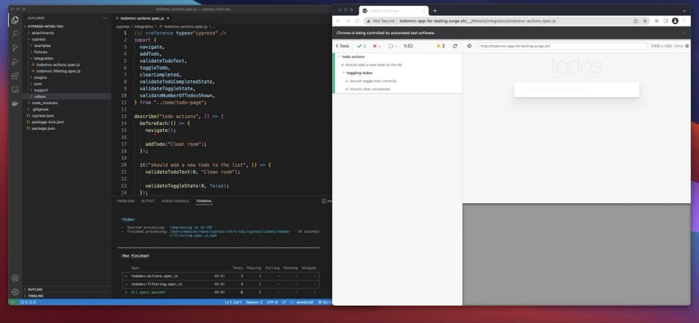

# Introduction to Cypress - TAU Course by Gil Tayar

This repo contains sample test files that I used to learn [Cypress](https://docs.cypress.io/guides/overview/why-cypress) and practice web UI test automation. Online course: [Introduction to Cypress](https://testautomationu.applitools.com/cypress-tutorial/)



## Pre-requisites

- [Node.js](https://nodejs.org/en/)
- [Visual Studio Code](https://code.visualstudio.com/)
- [Introduction to JavaScript](https://testautomationu.applitools.com/javascript-tutorial/)

## Installation

You can clone this repository to your local or download it as zip but don't forget to do `npm install` prior to executing any test.

## Folder: cypress

Groups all other folders, like examples, integration, fixtures, etc

## Folder: examples

Contans files demonstrating how to write test using Cypress. Installed automatically with Cypress.


## Folder: integration

Contains specs - tests written as JS scripts using Cypress functionality.

## Folder: pom

Contans files demonstrating how to create modules and use Page Object Model (POM) in tests.

## Usage

Run all tests in `integration` folder

```shell
npm test
```

Open Cypress desktop app

```shell
npx cypress open
```

Run cypress tests in headless mode using `npx` command

```Shell
npx cypress run
```

View help

```bash
npx cypress run --help
```

Run single file

```bash
npx cypress run --spec cypress/integration/todomvc-actions.spec.js
```
